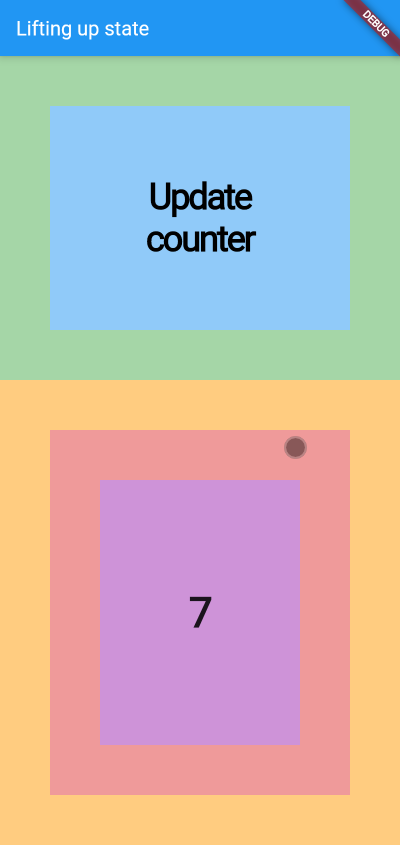
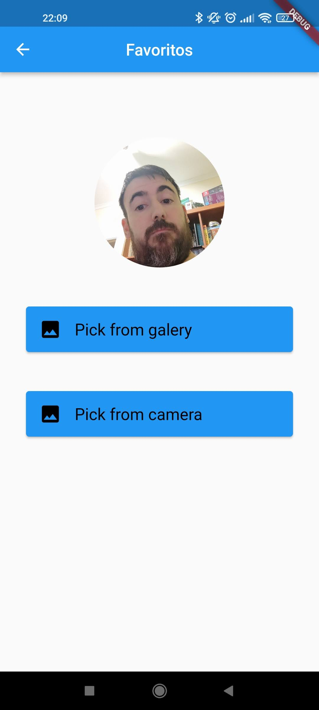

## PEC35

### Github: https://github.com/B3RTG/M0665PEC5

In folder "Screenshots" there are some screenshots for each activity.

Moreover, I added video links for demo apps of eachone of the activities:

- Activity 1 - Provider
  
  - Video: [Link](https://youtu.be/zHyzTJuUCAM)
  - Screenshots:
  
    

- Activity 2 - library - webview
  - Video: [Link](https://youtu.be/HHVYFvhRqK8)
  - Screenshots:
  
    

- Activity 4 - Capstone project - Pokedex
    App that get data from pokeapi.co with http.
    - Libraries:
      - http: ^0.13.4
      - flutter_slidable: ^1.2.0
      - shared_preferences: ^2.0.12
      - image_picker: ^0.8.4+4
      - path_provider: ^2.0.8
      - get_storage: ^2.0.3
  
  - Video: [Link](https://youtu.be/vXcG-rXCzys)
  - Screenshots:
  
    
    
    
    
    
    
